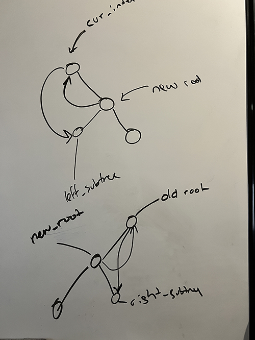

date: 2024-10-17
time: 9:21pm
tags: 
    - code

I first implemented a <code>scapegoat tree</code> and then I tried to repurpose my code in order to also implement an <code>AVL tree</code>. This didn't work out very well because of the non-recurive method I used to implement the scapegoat tree.  
I ended up re-writing a lot of code in order to finish this project... I also had a jolly time figuring out the borrowing rules in <code> Rust</code>.   
Here is a picture of me whiteboarding some tree rotations:

