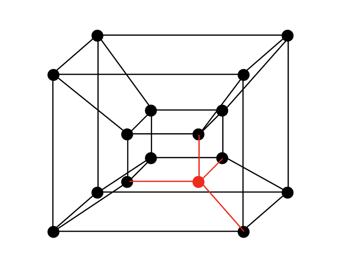

date: 2024-10-01
time: 9:41pm
tags: 
    - code
    - life 

I learned Figma a while ago for UI/UX design. I haven't used it in a while now, but I found a use in my graph theory class.  
Here is a 4-dimensional hypercube made in Figma. It also happens to be a 4-regular graph with no 3-cycles as subgraphs: 

